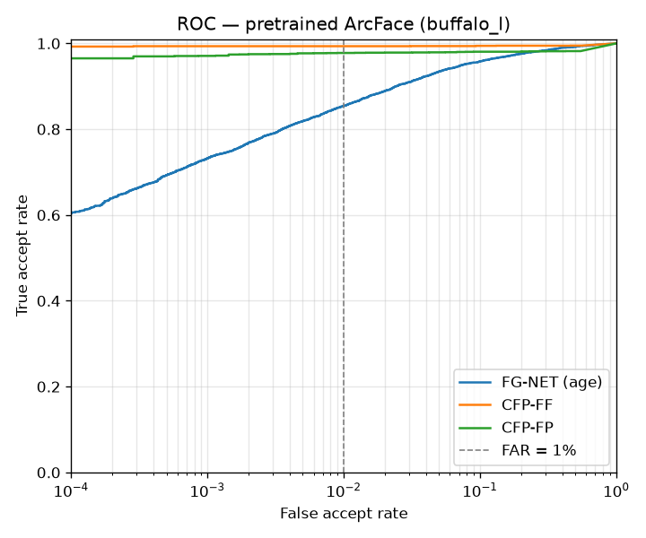

# Phase 1 baseline evaluation

Generated 2026-09-23 11:45 UTC by `python -m evaluation.run`. Model: InsightFace `buffalo_l` (RetinaFace detector + ArcFace R50), CPU. Scores are cosine similarity clamped to [0, 1].

**Operating threshold:** 0.2589. It's calibrated on FG-NET so that FAR = 1%.

## PRD §2 targets

| Target | Result | Goal | Met |
|---|---|---|---|
| Age gap, adult pairs (both ≥ 18): TAR on FG-NET at the operating threshold | 99.48% | ≥ 90% | yes |
| Age gap, adult pairs (both ≥ 18): FAR on FG-NET at the operating threshold | 0.65% | ≤ 1% | yes |
| Pose: TAR on CFP-FP at the operating threshold | 96.29% | ≥ 85% | yes |
| Pose: FAR on CFP-FP at the operating threshold | 0.00% | ≤ 1% | yes |
| Latency per match (CPU, median / p95) | 0.88s / 1.15s | < 2s | yes |

The age target is measured on adult pairs because the real use case is adult-to-adult comparison (PRD §4). For reference, TAR on **all** FG-NET pairs, childhood included, is 85.42% at FAR=1%.

## FG-NET: adult pairs (both photos age ≥ 18)

- 64 subjects. Pairs: 1164 genuine, 64177 impostor
- AUC 0.9998, EER 0.64%. TAR at this slice's own FAR=1% threshold (0.2418): 99.66%

| Age gap (years) | Genuine pairs | TAR at operating threshold | Median score |
|---|---|---|---|
| 0-4 | 303 | 99.34% | 0.702 |
| 5-9 | 297 | 100.00% | 0.657 |
| 10-19 | 354 | 100.00% | 0.618 |
| 20-29 | 150 | 100.00% | 0.552 |
| 30+ | 60 | 93.33% | 0.498 |

## FG-NET: all pairs (includes childhood photos)

- Pairs: 5808 genuine, 495693 impostor
- Faces not found: 0 of 1002 images. Images with several faces: 0 (the largest face was used)
- AUC 0.9826, EER 5.89%
- Child (under 13) vs. adult genuine pairs: 57.74% recognised (n = 1195). Most of the all-pairs shortfall comes from these.

| Age gap (years) | Genuine pairs | TAR at operating threshold | Median score |
|---|---|---|---|
| 0-4 | 1655 | 97.64% | 0.620 |
| 5-9 | 1590 | 94.97% | 0.513 |
| 10-19 | 1700 | 76.35% | 0.387 |
| 20-29 | 575 | 66.96% | 0.366 |
| 30+ | 288 | 52.78% | 0.271 |

## CFP (pose, official 10-fold protocol)

| Protocol | 10-fold accuracy | AUC | EER | TAR @ FAR=1% (own threshold) | TAR / FAR at operating threshold |
|---|---|---|---|---|---|
| FF | 99.66% ± 0.23% | 0.9958 | 0.34% | 99.34% | 99.23% / 0.00% |
| FP | 98.56% ± 0.39% | 0.9855 | 2.07% | 97.77% | 96.29% / 0.00% |

Faces not found: 11 of 5000 frontal images and 33 of 2000 profile images.

## Caveats

- The threshold is calibrated and tested on the same FG-NET pairs. That makes the FG-NET FAR exactly 1% by construction. CFP is the independent check of how well the threshold transfers.
- A failed detection scores 0, which counts as a rejection. This is conservative for genuine pairs.
- The adult slice is small (64 subjects), and its widest age-gap bins have few pairs. Treat those rows as indicative, and spot-check with your own photos.
- Neither dataset has demographic labels, so this report has no per-slice bias check (PRD §8).

